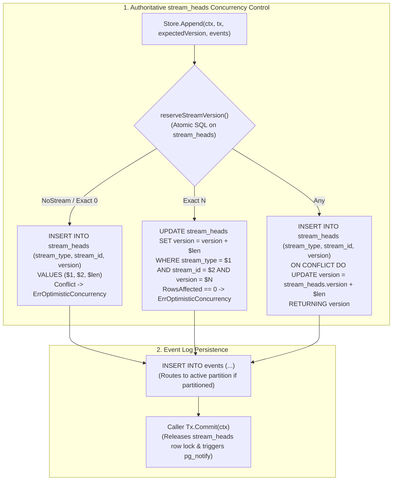

# Implementation Plan: Authoritative Stream Heads Optimistic Concurrency, Range Partitioning & Extended Test Suite

## Goal Description

This project achieves two primary architectural enhancements for `github.com/eventsalsa/store`, along with comprehensive test coverage:

1. **Authoritative `stream_heads` Optimistic Concurrency Engine**:
   Transform `stream_heads` from a passive cache into the single, authoritative atomic version reservation point in PostgreSQL before inserting events. This fixes race conditions under concurrent `Any()` appends, detects optimistic concurrency conflicts immediately at the row-lock level, guarantees strict consecutive version assignment, and safely enables unconstrained scaling on partitioned tables.

2. **Optional Range Partitioning on `global_position` (`Native` & `pg_partman`)**:
   Add support for PostgreSQL declarative `RANGE (global_position)` partitioning on the `events` table to support massive event logs with partition pruning, index efficiency, and clean archival/retention boundaries. Provide both native static partition generation and dynamic `pg_partman` management with `pg_partman_bgw` (Background Worker), `pg_cron`, or external maintenance scripts.

3. **Complete Test Suite & Gap Coverage**:
   Implement exhaustive concurrency race condition test suites, PostgreSQL NOTIFY verification, protocol mode testing (simple protocol / pgBouncer), complex Go struct type mappings in `eventmap`, and boundary reader edge cases.

---

## Proposed Changes

### Phase 1: Stream Heads Optimistic Concurrency Engine & Concurrency Test Suite

#### [MODIFY] [`postgres/store.go`](postgres/store.go)
- Introduce internal helper `reserveStreamVersion(ctx, tx, streamType, streamID, expectedVersion, count) (versionRange, error)`.
- Replace read-then-insert-then-upsert logic in `Append` with atomic reservation on `stream_heads` prior to event insertion.
- Assign versions sequentially starting at `firstVersion + i`.

#### [NEW] [`postgres/integration_test/concurrency_test.go`](postgres/integration_test/concurrency_test.go)
- 8 high-concurrency race condition scenarios (50 concurrent goroutines with `NoStream`, `Exact(0)`, `Exact(N)`, `Any()`, rollbacks, and multi-stream contention).

#### [EXPAND] [`event_test.go`](event_test.go)
- Add unit tests for `store.NullString.Scan()` and `store.NullString.Value()`.

---

### Phase 2: PostgreSQL Partitioning & Migration Generator (`Native`, `pg_partman`, `pg_cron`, `BGW`)

#### [MODIFY] [`migrations/generator.go`](migrations/generator.go)
- Add partition configuration types (`PartitionStrategy`, `PartmanMaintenance`, `PartitionConfig`).
- Support native range partitioning and `pg_partman` mode with `pg_cron`, `bgw`, or manual maintenance.

#### [MODIFY] [`cmd/migrate-gen/main.go`](cmd/migrate-gen/main.go)
- Add CLI flags for partitioning strategy, partition size, initial partition count, partman schema, and maintenance mode.

#### [EXPAND] [`migrations/generator_test.go`](migrations/generator_test.go)
- Add unit tests verifying generated SQL across all partitioning modes.

---

### Phase 3: Partitioned Store Integration & Full Gap Coverage Test Suite

#### [NEW] [`postgres/integration_test/partitioning_test.go`](postgres/integration_test/partitioning_test.go)
- Partition lifecycle tests: cross-boundary appends, batch boundary straddling, multi-partition `ReadStream`, pagination, and latest global position.

#### [NEW] [`postgres/integration_test/notify_test.go`](postgres/integration_test/notify_test.go)
- Verify `WithNotifyChannel` and transaction rollback suppression.

#### [NEW] [`postgres/integration_test/protocol_mode_test.go`](postgres/integration_test/protocol_mode_test.go)
- Test with `pgx.QueryExecModeSimpleProtocol`, binary payloads, JSONB metadata, and boundary edge cases.

#### [EXPAND] [`eventmap/integration_test.go`](eventmap/integration_test.go)
- Test domain events with pointer, slice, and map fields.

---

### Phase 4: Documentation & Operator Guides

#### [NEW] [`docs/partitioning.md`](docs/partitioning.md)
- Complete DBA guide explaining range partitioning architecture, `stream_heads` concurrency control, native pre-allocation, `pg_partman`, and partition detachment.

#### [MODIFY] [`README.md`](README.md)
- Update architectural documentation with partitioning options and `migrate-gen` CLI flags.
