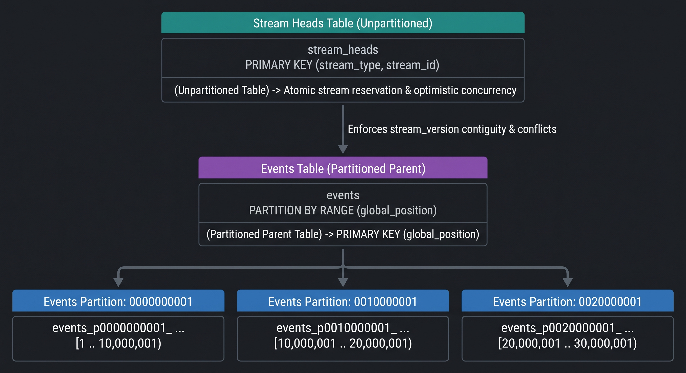

# Range Partitioning Guide & DBA Runbook

`eventsalsa/store` supports optional **declarative PostgreSQL range partitioning** on the `events` table by `global_position`. This allows event stores scaling to hundreds of millions or billions of events to maintain fast B-tree index scans and optimize I/O, autovacuum, and write throughput.

---

## Architecture Overview



### Why Partition on `global_position`?
1. **Append-Only Monotonic Order**: All appends write sequentially into the newest partition. Older partition indexes become read-only and stay hot in the OS page cache.
2. **Sequential Consumer Pagination**: Consumers reading `ReadEvents(ctx, tx, lastPos, limit)` scan contiguous ranges within one or two partitions at a time.
3. **Optimistic Concurrency Control**: In PostgreSQL, parent tables partitioned by `RANGE (global_position)` cannot enforce cross-partition `UNIQUE (stream_type, stream_id, stream_version)` because the partition key is not part of the unique tuple. To guarantee optimistic concurrency across partitions, `eventsalsa/store` uses the `stream_heads` table to atomically reserve stream version ranges before writing to `events`.

---

## Migration Generation Modes

Partitioning is strictly optional. By default, `cmd/migrate-gen` generates standard unpartitioned tables.

### 1. Native Range Partitioning

Native partitioning creates a sequence and pre-allocates a configured number of partition tables with zero-padded bounds.

```bash
go run github.com/eventsalsa/store/cmd/migrate-gen \
  -output migrations \
  -partition-strategy native \
  -partition-size 10000000 \
  -initial-partitions 4
```

This generates:
- `events_global_position_seq`
- Parent `events` table with `PARTITION BY RANGE (global_position)`
- Pre-created initial partitions:
  - `events_p0000000001_p0010000000` (values from 1 to 10,000,001)
  - `events_p0010000001_p0020000000` (values from 10,000,001 to 20,000,001)
  - `events_p0020000001_p0030000000` (values from 20,000,001 to 30,000,001)
  - `events_p0030000001_p0040000000` (values from 30,000,001 to 40,000,001)
- `stream_heads` table and all parent indexes (automatically propagated to all child partitions).

### 2. `pg_partman` Dynamic Partitioning

For automated partition creation without manual intervention, `eventsalsa/store` integrates with [`pg_partman`](https://github.com/pgpartman/pg_partman).

#### Option A: Automated Maintenance with `pg_cron`

```bash
go run github.com/eventsalsa/store/cmd/migrate-gen \
  -output migrations \
  -partition-strategy partman \
  -partman-maintenance pg_cron \
  -partition-size 10000000 \
  -initial-partitions 4
```

This generates:
```sql
CREATE EXTENSION IF NOT EXISTS pg_partman WITH SCHEMA partman;
CREATE EXTENSION IF NOT EXISTS pg_cron;

SELECT partman.create_parent(
    p_parent_table => 'public.events',
    p_control => 'global_position',
    p_type => 'native',
    p_interval => '10000000',
    p_premake => 4
);

SELECT cron.schedule('partman-maintenance-events', '0 * * * *', $$CALL partman.run_maintenance_proc()$$);
```

#### Option B: Automated Maintenance with `pg_partman_bgw` (Background Worker)

```bash
go run github.com/eventsalsa/store/cmd/migrate-gen \
  -output migrations \
  -partition-strategy partman \
  -partman-maintenance bgw
```

Configure `postgresql.conf` on your PostgreSQL server:
```ini
shared_preload_libraries = 'pg_partman_bgw'
pg_partman_bgw.interval = 3600
pg_partman_bgw.role = 'postgres'
pg_partman_bgw.dbname = 'mydb'
```

#### Option C: External / Manual Maintenance

```bash
go run github.com/eventsalsa/store/cmd/migrate-gen \
  -output migrations \
  -partition-strategy partman \
  -partman-maintenance none
```

Run or trigger periodically via your scheduler (e.g. Kubernetes CronJob or systemd timer):
```sql
CALL partman.run_maintenance_proc();
```

---

## DBA Runbook & Operations

### Pre-Creating Partitions Ahead of Time (Native Mode)

When using native partitioning, ensure future partitions are created before the current `global_position` reaches the highest boundary.

You can inspect the current sequence position:
```sql
SELECT last_value FROM events_global_position_seq;
```

To create the next partition:
```sql
-- Example: creating partition for 40,000,001 to 50,000,000
CREATE TABLE IF NOT EXISTS events_p0040000001_p0050000000 PARTITION OF events
    FOR VALUES FROM (40000001) TO (50000001);
```
